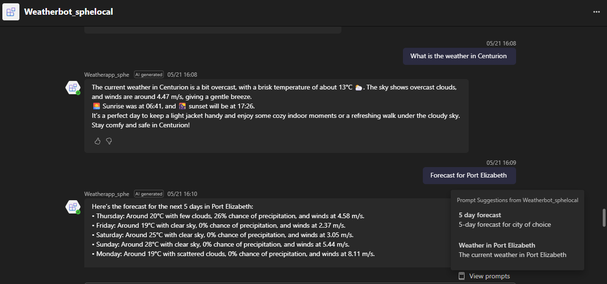

# ⛅ WeatherBot for Microsoft Teams

WeatherBot is a Microsoft Teams AI chatbot built with the Teams Toolkit. It provides real-time weather updates and demonstrates how to build conversational AI apps integrated with Microsoft Teams.

## Features

- Weather querying via natural language
- Built using Microsoft Teams Toolkit (Python SDK)
- Deployed as a bot on Teams with support for local and cloud environments
- Integrated error handling middleware

## Tech Stack

- Python
- aiohttp (web server)
- Microsoft Teams AI SDK
- OpenWeatherMap API 
- dotenv for secrets

## Project Structure

Weatherbot_sphe/
├── src/ # Source code (app.py, bot setup)
├── appPackage/ # Teams app manifest files
├── infra/ # Azure infrastructure configuration
├── .env # Environment variables
├── requirements.txt # Python dependencies
├── README.md # This file
└── .gitignore # Git ignore rules


## Getting Started

1. Clone the repo:
```bash
git clone https://github.com/SiphesihleNocanda/weatherbot-teams.git
cd weatherbot-teams
```
2. Install dependencies:
```bash 
pip install -r requirements.txt 
````

3. Set your environment variables in a .env file:
```bash
OPENAI_API_KEY=your-key
WEATHER_API_KEY=your-weather-key
```
4. Run the app locally:
```bash
python src/app.py
```
# Screenshot


# Learnings
How to build Teams bots using Python

Middleware integration with aiohttp

Secrets management with .env

Deploying Teams bots using Teams Toolkit

# Future Improvements
Add location detection from user query

Support for forecast and severe weather alerts

Integrate with Bing Maps API for enhanced results

# About Me
I'm Siphesihle Nocanda, a BSc graduate passionate about creating intelligent tools that make people's lives easier. I enjoy building AI assistants that are both helpful and accessible.